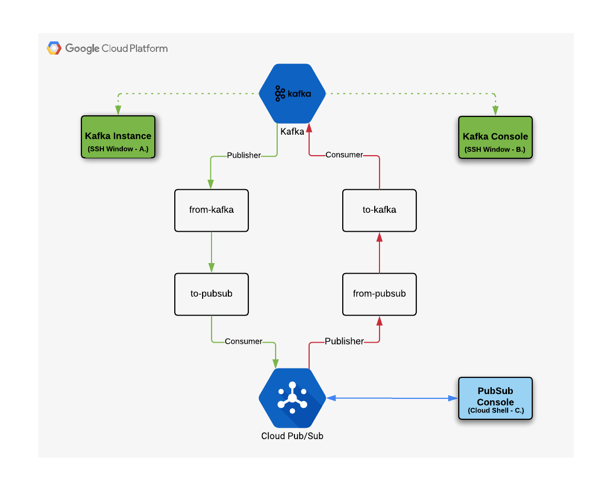
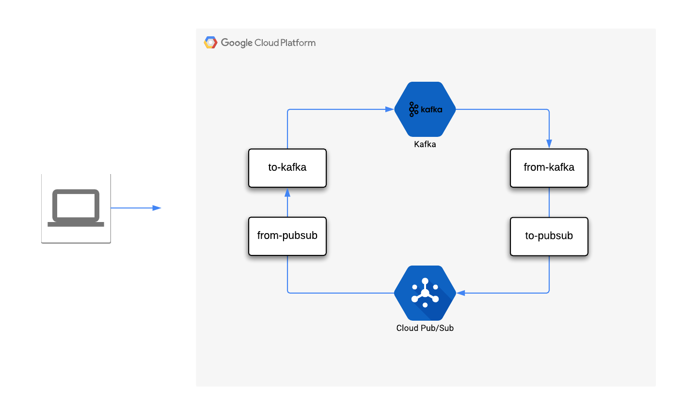
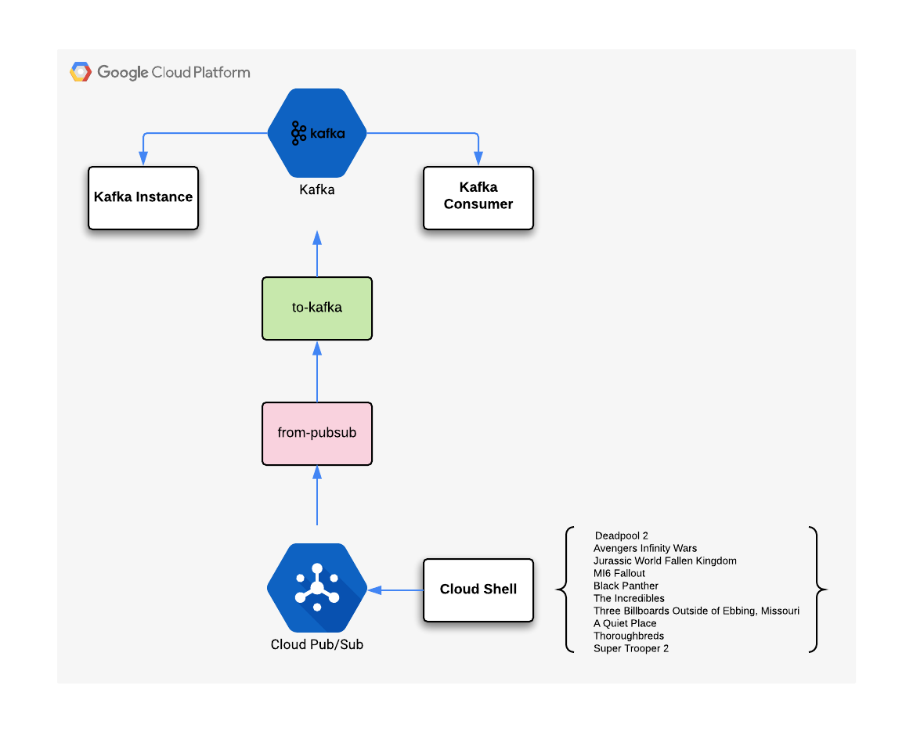
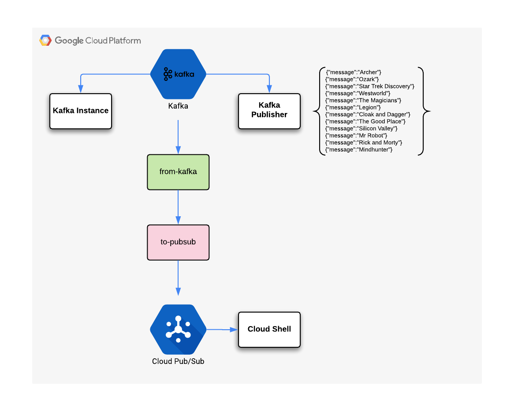

# Overview
In this lab, you launch a Confluent Kafka instance and use it to communicate with Cloud Pub/Sub. You learn how to:

- Initiate Cloud Launcher to create an instance of Confluent Kafka
- Configure a Kafka connector to integrate with Pub/Sub
- Setup topics and subscriptions for message communication
- Perform basic testing of both Kafka and Cloud Pub/Sub services
- Connect IoT Core to Cloud Pub/Sub

Source: [Qwicklab](https://www.qwiklabs.com/focuses/2766?parent=catalog)

For this lab you will be using multiple SSH sessions.You might want to think about how to organize them on your desktop. Leave these windows open during your lab.

<style type="text/css">
.tg  {border-collapse:collapse;border-spacing:0;}
.tg td{font-family:Arial, sans-serif;font-size:14px;padding:10px 5px;border-style:solid;border-width:1px;overflow:hidden;word-break:normal;border-color:black;}
.tg th{font-family:Arial, sans-serif;font-size:14px;font-weight:normal;padding:10px 5px;border-style:solid;border-width:1px;overflow:hidden;word-break:normal;border-color:black;}
.tg .tg-1wig{font-weight:bold;text-align:left;vertical-align:top}
.tg .tg-7btt{font-weight:bold;border-color:inherit;text-align:center;vertical-align:top}
.tg .tg-0pky{border-color:inherit;text-align:left;vertical-align:top}
.tg .tg-0lax{text-align:left;vertical-align:top}
</style>
<table class="tg">
  <tr>
    <th class="tg-7btt">Name</th>
    <th class="tg-7btt">Identifier</th>
    <th class="tg-1wig">Description</th>
  </tr>
  <tr>
    <td class="tg-0pky">Kafka Instance</td>
    <td class="tg-0pky">SSH Window A</td>
    <td class="tg-0lax">This window will be used to run the application in the backgroud</td>
  </tr>
  <tr>
    <td class="tg-0pky">Kafka Console</td>
    <td class="tg-0pky">SSH Window B<br>(Publisher/Consumer)</td>
    <td class="tg-0lax">This window is used to access the Kafka command line</td>
  </tr>
  <tr>
    <td class="tg-0pky">Cloud PubSub Console</td>
    <td class="tg-0pky">Cloud Shell C.</td>
    <td class="tg-0lax">This shell is required to setup PubSub and view the queue</td>
  </tr>
</table>



# Introduction 
With the announcement of the Google Cloud Confluent managed Kafka offering, it has never been easier to use Google Cloud's great data tools with Kafka. You can use the Apache Beam Kafka.io connector to go straight into Dataflow, but this may not always be the right solution.

Whether Kafka is provisioned in the Cloud or on premise, you might want to push messages to a subset of Pub/Sub topics. Why? For the flexibility of having Pub/Sub as your GCP event notifier. Then you could not only choreograph Dataflow jobs, but also use topics to trigger Cloud Functions.

So how do you exchange messages between Kafka and Pub/Sub? This is where the Pub/Sub Kafka Connector comes in handy. In this lab you will learn the basic steps to start working with a Kafka connector on Google Cloud.

```
Tip: In this lab Cloud Launcher is used to create a single instance of Kafka. This Kafka instance connects to Cloud Pub/Sub and exchanges event messages between the two services.

In the real world, Kafka would likely be run in a cluster, but for this lab you will develop a simpler (and cheaper) usage pattern.
```

The following diagram illustrates the high-level architecture for this lab.



# Configure the Kafka VM instance

## Launch a Kafka instance via Marketplace
1. In the GCP Console, in the left-hand Navigation menu, click Marketplace.
2. Locate the Apache Kafka deployment by searching for Kafka.
3. Click on the Google deployment of Kafka and read about the service provided by the software.
4. Click on the blue **Launch On Compute Engine** button.
5. You can accept the default setting, or make changes based on your requirements. For example, selecting a Zone that is closer in locality. Check off the Terms of Service box, then click **Deploy**.
Once the deployment completes, a new VM instance named *kafka-1-vm* is available in the zone you selected.

## Enable the cloud PubSub API
Next you need to alter the Cloud API scope on the VM created to enable the cloud Pub/Sub API.

1. Click on the instance name on the right side of the screen, then **Stop** the Kafka virtual machine instance. Refresh your screen and wait until you see the instance has stopped before continuing. It will take 1-2 minutes. Refresh your screen to make sure you're looking at the most recent information. You will see a new icon next to the name indicating it is stopped.

2. Click Edit then scroll down and select **Allow full access to all Cloud APIs** in the Access scopes section, then click **Save**.

3. Restart the Kafka virtual machine instance by clicking Start. There will be a confirmation message when it has restarted. Refresh your screen to make sure you're lookin at the most recent information.

## Configure the Kafka VM instance

1. In the Console, go to Navigation Menu > Compute Engine and open a SSH cloud shell to the Kafka VM. (This is SSH Window A.)
2. In the SSH window, set an environment variable to the project identifier
```shell
export PROJECT_ID=[PROJECT_ID]
```
3. Copy the generated jar file from the storage bucket to the Kafka VM
```shell
gsutil cp gs://cloud-training/gsp285/binary/cps-kafka-connector.jar .
```
4. Create the destination sub-directory for the Kafka connector:
```shell
sudo mkdir -p /opt/kafka/connectors
```
5. Move the download jar file to the directory created for the Kafka application
```shell
sudo mv ./cps-kafka-connector.jar /opt/kafka/connectors/
```
6. Update the java connector file permissions to be executable 
```shell
sudo chmod +x /opt/kafka/connectors/cps-kafka-connector.jar
```
7. Change the current directory to /opt/kafka/config:
```shell
cd /opt/kafka/config
```
8. Create new file cps-sink-connector.properties with the following content (replacing PROJECT_ID with your GCP Project ID):
```shell
name=CPSSinkConnector
connector.class=com.google.pubsub.kafka.sink.CloudPubSubSinkConnector
tasks.max=10
topics=to-pubsub
cps.topic=from-kafka
cps.project=PROJECT_ID
```
9. Create new file cps-source-connector.properties with the following content (replacing PROJECT_ID with your GCP Project ID):
```shell
name=CPSSourceConnector
connector.class=com.google.pubsub.kafka.source.CloudPubSubSourceConnector
tasks.max=10
kafka.topic=from-pubsub
cps.subscription=to-kafka-sub
cps.project=PROJECT_ID
```
The Kafka application is now configured to use the connector. Leave this SSH connection to the Kafka VM instance open, so we can finish the configuration and run the application later.

## Pub/Sub Topic and Subscription setup
1. In the Cloud Shell window, set an environment variable to the project identifier.
```shell
export PROJECT_ID=[PROJECT_ID]
```

2. Configure the Pub/Sub topics to communicate with Kafka:
```shell
gcloud pubsub topics create to-kafka from-kafka
```

3. Create a subscription for the to-kafka topic:
```shell
gcloud pubsub subcriptions create to-kafka-sub --topic=to-kafka --topic-project=$PROJECT_ID
```

Pub/Sub is now configured with two topics. A subscription has also been created on the "to-kafka" topic using the PROJECT_ID variable.
This configuration allows messages to be consumed by Pub/Sub. Go look at Pub/Sub in Console

4. Now create a subscription for traffic published from Kafka:
```shell
gcloud pubsub subcriptions create from-kafka --topic=from-kafka
```

## Start the Kafka VM application instance
Now we will setup the Kafka VM Topic

1. Return to the Kafka VM instance (SSH Window A) and submit the following command:
```shell
cd /opt/kafka
```
2. Create a topic that will exchange information to Pub/Sub:
```shell
kafka-topics.sh --create --zookeeper localhost:2181 --replication-factor 1 --partitions 1 --topic to-pubsub
```
3. Create a topic that will receive messages from PubSub
```shell
kafka-topics.sh --create --zookeeper localhost:2181 --replication-factor 1 --partitions 1 --topic from-pubsub
```
4. You need to make a couple of edits to the existing file located in /opt/kafka/config/connect-standalone.properties
- first, uncomment the plugin path that is located at the bottom of the file and update it to the following
```shell
plugin.path=/opt/kafka/connectors
```
- Second, toggle the key and value converter for schema enforcement to the setting false, close the editor when you're done
```shell
key.converter.schemas.enable=false
value.converter.schemas.enable=false
```
6. Move back to the user home directory
```shell
cd ~
```
7. Create new file run-connector.sh
```shell
#!/bin/bash

/opt/kafka/bin/connect-standalone.sh /opt/kafka/config/connect-standalone.properties \
/opt/kafka/config/cps-sink-connector.properties \
/opt/kafka/config/cps-source-connector.properties
 ```
8. Update the file permissions to allow it to be executed from the command line: 
```shell
sudo chmod +x ./run-connector.sh
```
9. Start the connect service
```shell
sudo chmod +x ./run-connector.sh
```
10. Start the connect service
```shell
./run-connector.sh
```
The Kafka service should now be running on the VM. Leave this session open so that any errors can be seen.

## Data exchange between Kafka and Pub/Sub
Test Kafka to Pub/Sub (producer/consumer) communication by opening a new SSH window where the Kafka commands will be run.

1. Open a new SSH connection to the Kafka VM, this is SSH Window B. Enter the following command to initiate a Kafka console:
```shell
kafka-console-producer.sh --broker-list localhost:9092 --topic to-pubsub
```
2. From the Kafka console enter the following elements to send some message to topic to-pubsub
```shell
{"message":"Hello"}
{"message":"Big Data"}
```
3. Return to the Cloud Shell to see the information submitted earlier
```shell
gcloud pubsub subcriptions pull from-kafka --auto-ack --limit=10
```
Cloud Shell Example Output
```shell
┌────────────────────┬─────────────────┬────────────┐
│        DATA        │    MESSAGE_ID   │ ATTRIBUTES │
├────────────────────┼─────────────────┼────────────┤
│ {message=Hello}    │ 169722717841938 │            │
│ {message=Big Data} │ 169724507782910 │            │
└────────────────────┴─────────────────┴────────────┘
```
Kafka to Pub/Sub messaging is configured and working as expected.

## Test Pub/Sub to Kafka
1. In SSH Window B, enter the following command:
```shell
kafka-console-consumer.sh --bootstrap-server=localhost:9092 --value-deserailizer=org.apache.kafka.common.serialization.StringDeserializer --topic from-pubsub
```
2. In the active Cloud Shell window, publish a topic to be consumed by Kafka
```shell
gcloud pubsub topics publish to-kafka --attribute=data=hello
```
Check SSH Window B for the Kafka VM Example Output
```shell
{"message":"","data":"hello"}
```
Pub/Sub to Kafka message is configured and working as expected.

## Pub/Sub to Kafka Testing
Your architecture for testing Pub/Sub to Kafka is as illustrated below: 

```
Note: Ensure that a Kafka instance is actually running in the background - there should still be an open window showing the output from the instance.

If the application instance is not currently running, open a new SSH connection to Kafka and run the command ./run-connector.sh at the command line.
```
1. In the consumer/producer SSH session (SSH Window B), enter the following command to start a kafka consumer listenning topic **from-pubsub**
 ```shell
kafka-console-consumer.sh --bootstrap-server=localhost:9092 --value-deserializer=org.apache.kafka.common.serialization.StringDeserializer --topic from-pubsub
```
2. From Cloud Shell, you'll create some example content by making file named movies.txt
```shell
Deadpool 2
Avengers Infinity Wars
Jurassic World Fallen Kingdom
MI6 Fallout
Black Panther
The Incredibles
Three Billboards Outside of Ebbing Missouri
A Quiet Place
Thoroughbreds
Super Trooper 2
```
3. Enter the following script to publish your movie messages to the Kafka consumer via Google Cloud PubSub topic
 ```shell
while read i; do gcloud pubsub topics publish to-kafka --attribute=data="$i"; done < movies.txt
```
From the above command a stream of messages should be observable on the Kafka consumer window.

In this example we have sent a steam of information between two services. As the example demonstrates, exchanging information once configured is fairly straightforward.

## Kafka to Pub/Sub testing
Our architecture for testing Kafka to Pub/Sub is illustrated as belowed: 

1. Cancel actual Kafka running consumer by **Ctr+c** in SSH Window B, then make a text file tv.json and add the following contents: 
 ```shell
{"message":"Archer"}
{"message":"Ozark"}
{"message":"Star Trek Discovery"}
{"message":"Westworld"}
{"message":"The Magicians"}
{"message":"Legion"}
{"message":"Cloak and Dagger"}
{"message":"The Good Place"}
{"message":"Silicon Valley"}
{"message":"Mr Robot"}
{"message":"Rick and Morty"}
{"message":"Mindhunter"}
```
2. Now use the following script to publish your TV messages to the Kafka topic to-pubsub
 ```shell
kafka-console-producer.sh --broker-list localhost:9092 --topic to-pubsub < tv.json
```
Thanks to Kafka connector, TV messages on the topic to-pubsub are consummed and sent to PubSub topic from-kafka
3. From the Cloud Shell window, run the following command to view the message that have been published from Kafka: 
 ```shell
gcloud pubsub subcriptions pull from-kafka --auto-ack --limit=10
```
In this example you have sent a stream of information between two services. When passing information via Kafka, the message content is formatted as JSON. 
