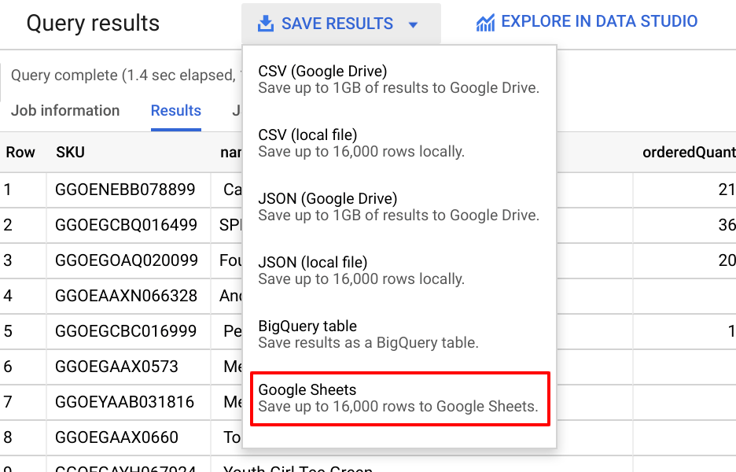

# Overview

BigQuery is Google's fully managed, NoOps, low cost analytics database. With BigQuery you can query terabytes and terabytes of data without having any infrastructure to manage or needing a database administrator. BigQuery uses SQL and can take advantage of the pay-as-you-go model. BigQuery allows you to focus on analyzing data to find meaningful insights.

The dataset you'll use is an ecommerce dataset that has millions of Google Analytics records for the Google Merchandise Store loaded into BigQuery. You have a copy of that dataset for this lab and will explore the available fields and row for insights.

In this lab, you will ingest several types of datasets into tables inside of BigQuery.

# Create a new dataset to store tables

In the BigQuery console, click on the name of your project, then click Create Dataset. Set the Dataset ID to ecommerce. Leave the other fields at their default values and Click Create dataset. You'll now see the ecommerce dataset under your project name.

# Ingest a new Dataset from a CSV

Scenario: Your marketing team is looking to you to help guide them with what products should be up for promotions based on inventory stock levels. They have also asked how each product is trending in customer sentiment based on the product reviews.

Your existing ecommerce transactional dataset does not have inventory stock levels or product review data in it, but your operations and marketing teams have provided you with new datasets for you to analyze.

Download the product stock level dataset locally onto your computer:
https://storage.googleapis.com/data-insights-course/exports/products.csv

Specify the below table options:

Source:

- Create table from: Upload
- Select file: select the file you downloaded locally earlier
- File format: CSV

Destination:

- Table name: products
Leave other settings at their default value.

Schema:

- Check Auto Detect for Schema and input parameters
Tip: Not seeing the checkbox? Ensure the file format is CSV and not Avro.

- Partition and Cluster settings: Leave at default settings
  
Advanced Options: Leave at default settings

Click Create Table and You should now see the products table below the ecommerce dataset.

**BigQuery command line solution**

```shell
wget https://storage.googleapis.com/data-insights-course/exports/products.csv
bq load --autodetect [project id]:[dataset name].products products.csv
```

# Ingest data from Google Cloud Storage
Select the ecommerce dataset and click Create Table.

Specify the below table options:

- Source:
  - Create table from: Google Cloud Storage
  - Select file from GCS bucket: gs://data-insights-course/exports/products.csv
  - File format: CSV
- Destination:
  - Table name: products
Leave all other settings as default.
- Schema:
  - Check Auto Detect for Schema and input parameters.
- Advanced Options: Write **Preference dropdown menu**, select **Overwrite table**.

Click Create Table.
**BigQuery command line solution**

```shell
bq load --autodetect --replace [project id]:[dataset name].products gs://data-insights-course/exports/products.csv
```

# Ingest a new dataset from a Google Spreadsheet

The query belowed shows which products are in the greatest restocking need based on inventory turnover and how quickly they can be resupplied:

```sql
#standardSQL
SELECT
  *,
  SAFE_DIVIDE(orderedQuantity,stockLevel) AS ratio
FROM
  ecommerce.products
WHERE
# include products that have been ordered and
# are 80% through their inventory
orderedQuantity > 0
AND SAFE_DIVIDE(orderedQuantity,stockLevel) >= .8
ORDER BY
  restockingLeadTime DESC
```

## Saving Data to Google Sheets and Creating External table in BigQuery

Scenario: You want to provide your supply chain management team with a way to notate whether or not they have contacted the supplier to reorder inventory, and to make any notes on the items. You decide on using a Google Spreadsheet for a quick survey. In Query Results, select Save **Results > Google Sheets**.



A popup will appear with a link to Open the spreadsheet, select Open. In your spreadsheet, in column G add a new field titled **comments** and for the first product row type new shipment on the way

")

In Google Sheets, select Share and Get Shareable Link then copy the link. Return to your BigQuery tab. Click on the ecommerce dataset, then Create Table. Specify the these table options:

- Source:
  - Create table from: Drive
  - Select Drive URI: put-your-spreadsheet-url-here
  - File format: Google Sheet
- Destination:
  - Table type: Leave as default (External table)
  - Table name: products_comments
  - Schema: Check Auto Detect for Schema and input parameters

# External table performance and data quality considerations

Linking external tables to BigQuery (e.g. Google Spreadsheets or directly from Google Cloud Storage) has several [limitations](https://cloud.google.com/bigquery/external-data-sources#external_data_source_limitations). Two of the most significant are:

- Data consistency is not guaranteed if the data values in the source are changed while querying.
- Data sources stored outside of BigQuery lose the performance benefits of having BigQuery manage your data storage (including but not limited to auto-optimization of your query execution path, certain wildcard functions are disabled, etc.).