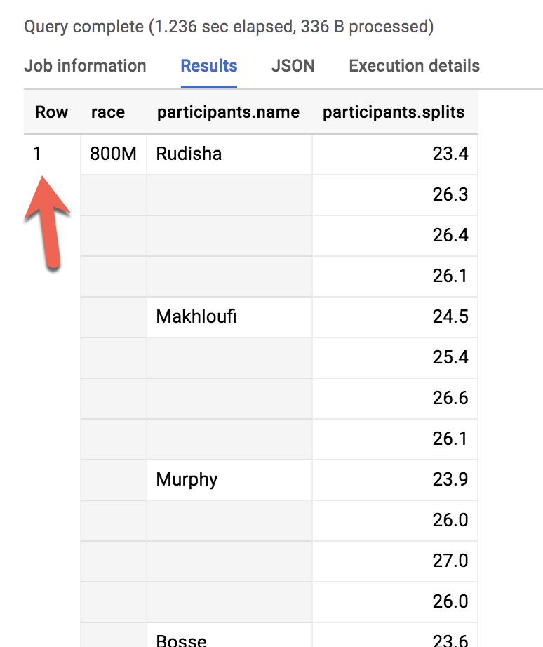

# Overview
BigQuery is Google's fully managed, NoOps, low cost analytics database. With BigQuery you can query terabytes and terabytes of data without having any infrastructure to manage or needing a database administrator. BigQuery uses SQL and can take advantage of the pay-as-you-go model. BigQuery allows you to focus on anaylyzing data to find meaningful insight. 

This lab is an in-depth walkthrough of working with semi-structured data (ingesting JSON, Array data types) inside of BigQuery. Denormalizing your schema into a single table with nested and repeated fields can yield performance improvements, but the SQL syntax for working with array data can be tricky. You will pratice loading, querying, troubleshooting and unnesting various semi-structured datasets. 

Reference: 
- Qwiklabs: [Working with JSON, Arrays, and Structs in BigQuery](https://google.qwiklabs.com/focuses/3696?parent=catalog)
- Documentation: [Working with Arrays in Standard SQL](https://cloud.google.com/bigquery/docs/reference/standard-sql/arrays)

## Create a new dataset to store our tables
In your BigQuery, click on your project name and then Create Dataset named fruit_store. Leave the other options at their default values. 

# Pratice working with Arrays in SQL

Normally in SQL you will have a single value for each row like this list of fruits below: 

<table class="tg">
  <tr>
    <th class="tg-1wig">Row</th>
    <th class="tg-1wig">Fruit</th>
  </tr>
  <tr>
    <td class="tg-0lax">1</td>
    <td class="tg-0lax">raspberry</td>
  </tr>
  <tr>
    <td class="tg-0lax">2</td>
    <td class="tg-0lax">blackberry</td>
  </tr>
  <tr>
    <td class="tg-0lax">3</td>
    <td class="tg-0lax">strawberry</td>
  </tr>
  <tr>
    <td class="tg-0lax">4</td>
    <td class="tg-0lax">cherry</td>
  </tr>
</table>

What if you wanted a list of fruit items for each person at the store? It could look something like this: 

<table class="tg">
  <tr>
    <th class="tg-1wig">Row</th>
    <th class="tg-1wig">Fruit</th>
    <th class="tg-1wig">Person</th>
  </tr>
  <tr>
    <td class="tg-0lax">1</td>
    <td class="tg-0lax">raspberry</td>
    <td class="tg-0lax">sally</td>
  </tr>
  <tr>
    <td class="tg-0lax">2</td>
    <td class="tg-0lax">blackberry</td>
    <td class="tg-0lax">sally</td>
  </tr>
  <tr>
    <td class="tg-0lax">3</td>
    <td class="tg-0lax">strawberry</td>
    <td class="tg-0lax">sally</td>
  </tr>
  <tr>
    <td class="tg-0lax">4</td>
    <td class="tg-0lax">cherry</td>
    <td class="tg-0lax">sally</td>
  </tr>
  <tr>
    <td class="tg-0lax">5</td>
    <td class="tg-0lax">orange</td>
    <td class="tg-0lax">frederick</td>
  </tr>
  <tr>
    <td class="tg-0lax">6</td>
    <td class="tg-0lax">apple</td>
    <td class="tg-0lax">frederick</td>
  </tr>
</table>

In traditional relational database SQL, you would look at the repetition of names and immediately think to split the above table into two separate tables: Fruit items and People. That process is called normalization (going from one table to many). This is common approach for transactional databases like MySQL. 

For data warehousing, data analysts often go the reverse direction (denormaization) and bring many separate tables into one large reporting table. The potential issues if you stored all your data in one giant table: The table row size could be too large for traditional reporting database. 

Now, you're going to learn a different approach that stores data at different levels of granularity all in one table using repeated fields: 

<table class="tg">
  <tr>
    <th class="tg-1wig">Row</th>
    <th class="tg-1wig">Fruit</th>
    <th class="tg-1wig">Person</th>
  </tr>
  <tr>
    <td class="tg-0lax" rowspan="4">1</td>
    <td class="tg-0lax">raspberry</td>
    <td class="tg-0lax" rowspan="4">sally</td>
  </tr>
  <tr>
    <td class="tg-0lax">blackberry</td>
  </tr>
  <tr>
    <td class="tg-0lax">strawberry</td>
  </tr>
  <tr>
    <td class="tg-0lax">cherry</td>
  </tr>
  <tr>
    <td class="tg-0lax" rowspan="2">2</td>
    <td class="tg-0lax">orange</td>
    <td class="tg-0lax" rowspan="2">frederick</td>
  </tr>
  <tr>
    <td class="tg-0lax">apple</td>
  </tr>
</table>

What looks strange about the previous table?
- It's only two rows
- There are multiple field values for Fruit in a single row
- The people are associated with all of the field values

What the key insight? The **array** data type! An easier way to interpret the Fruit array: 

<table class="tg">
  <tr>
    <th class="tg-1wig">Row</th>
    <th class="tg-1wig">Fruit</th>
    <th class="tg-1wig">Person</th>
  </tr>
  <tr>
    <td class="tg-0lax" rowspan="4">1</td>
    <td class="tg-0lax" rowspan="4">[raspberry, blackberry, cherry, strawberry]</td>
    <td class="tg-0lax" rowspan="4">sally</td>
  </tr>
</table>

Both of these tables are exactly the same. There are two key learnings:
- An array is simply a list of items in brackets []
- BigQuery visually displays arrays as flattended. It simply lists the value in the array vertically  (note that all of those values still belong to a single row)
- Data in an array must all be the same type. 

# Loading semi-structured JSON into BigQuery
What if you had a JSON file that you needed to ingest into BigQuery?

Create a new table fruit_details in the dataset. Add the following details for the table: 
- **Source**: Choose GCS in the Create table frop dropdown
- Select file from GCS bucket: **gs://data-insights-course/labs/optimizing-for-performance/shopping_cart.json**
- **File format**: JSON (Newline delimited)
- **Table name**: fruit_details 
- Check the checkbox of **Schema and input parameters**

In the schema, note that fruit_array is marked as REPEATED which means it's an array. 

**Recap**
- BigQuery natively supports arrays
- Array values must share a data type
- Arrays are called REPEATED fields in BigQuery

# Creating your own arrays with ARRAY_AGG()
```SQL
SELECT
  fullVisitorId,
  date,
  ARRAY_AGG(v2ProductName) AS products_viewed,
  ARRAY_AGG(pageTitle) AS pages_viewed
  FROM `data-to-insights.ecommerce.all_sessions`
WHERE visitId = 1501570398
GROUP BY fullVisitorId, date
ORDER BY date
```

Next, we will use the **ARRAY_LENGTH()** function to count the number of pages and products that were viewed. 
```SQL
SELECT
  fullVisitorId,
  date,
  ARRAY_AGG(v2ProductName) AS products_viewed,
  ARRAY_LENGTH(ARRAY_AGG(v2ProductName)) AS num_products_viewed,
  ARRAY_AGG(pageTitle) AS pages_viewed,
  ARRAY_LENGTH(ARRAY_AGG(pageTitle)) AS num_pages_viewed
  FROM `data-to-insights.ecommerce.all_sessions`
WHERE visitId = 1501570398
GROUP BY fullVisitorId, date
ORDER BY date
```

Next, lets deduplicate the pages and products so we can see how many unique products were viewed. We'll simply add **DISTINCT** to our **ARRAY_AGG()**
```SQL
SELECT
  fullVisitorId,
  date,
  ARRAY_AGG(DISTINCT v2ProductName) AS products_viewed,
  ARRAY_LENGTH(ARRAY_AGG(DISTINCT v2ProductName)) AS distinct_products_viewed,
  ARRAY_AGG(DISTINCT pageTitle) AS pages_viewed,
  ARRAY_LENGTH(ARRAY_AGG(DISTINCT pageTitle)) AS distinct_pages_viewed
  FROM `data-to-insights.ecommerce.all_sessions`
WHERE visitId = 1501570398
GROUP BY fullVisitorId, date
ORDER BY date
```

**Recap**
You can do some pretty useful things with arrays like: 
- finding the number of elements with **ARRAY_LENGTH(<'array'>)**
- deduplicating elements with **ARRAY_AGG(DISTINCT <'field'>)**
- ordering elements with **ARRAY_AGG(<'field'> ORDER BY <'field'>)**
- limiting **ARRAY_AGG(<'field'> LIMIT 5)**

# Querying datasets that already have ARRAYs
The BigQuery Public Dataset for Google Analytics **bigquery-public-data.google_analytics_sample** has many more fields and rows than our course dataset data-to-insights.ecommerce.all_sessions. More importantly, it already stores field values like products, pages, and transactions natively as ARRAYs. Copy and Paste the below query to explore the available data and see if you can find fields with repeated values (arrays)

```SQL
SELECT *
FROM `bigquery-public-data.google_analytics_sample.ga_sessions_20170801`
WHERE visitId = 1501570398
```
Scroll right in the results until you see the **hits.product.v2ProductName** field. You'll note a lot of seemingly 'blank' values in the results as you scroll. The fields that appear to be missing data are actually at a higher level of granularity than other fields

The amount of fields available in the Google Analytics schema can be overwhelming for our analysis. Let's try to query just the visit and page name fields like we did before. 

```SQL
SELECT
  visitId,
  hits.page.pageTitle
FROM `bigquery-public-data.google_analytics_sample.ga_sessions_20170801`
WHERE visitId = 1501570398
```

You will get an error: **Cannot access field product on a value with type ARRAY> at [5:8]**

Before we can query REPEATED fields (arrays) normally, you must first break the arrays back into rows. For example, the array for hits.page.pageTitle is stored currently as a single row like:

```shell
['homepage','product page','checkout']
```

and we need it to be

```shell
['homepage',
'product page',
'checkout']
```

How do we do that with SQL?

**Answer:** Use the **UNNEST()** function on your array field:

```SQL
SELECT DISTINCT
  visitId,
  h.page.pageTitle
FROM `bigquery-public-data.google_analytics_sample.ga_sessions_20170801`,
UNNEST(hits) AS h
WHERE visitId = 1501570398
LIMIT 10
```

We'll cover UNNEST() more in detail later but for now just know that: 
- You need to UNNEST() arrays to bring the array elements back into rows
- UNNEST() always follows the table name in your FROM clause (think of it conceptually like a pre-joined table)

# Introduction to STRUCTs 
You may have wondered why the field alias hit.page.pageTitle looks like three fields in one separated by periods. Just as **ARRAY** values give you the flexibility to go deep into the granularity of your fields, another data type allows you to go wide in your schema by grouping related fields together. That SQL data type is the **STRUCT** data type. 

The easiest way to think about a STRUCT is to consider it conceptually like a separate table that is already pre-joined into your main table. A STRUCT can have: 
- one or many fields in it
- the same or different data types for each field
- it's own alias

## Explore a dataset with STRUCTs
Under Resources find the **bigquery-public-data** dataset (https://console.cloud.google.com/bigquery?p=bigquery-public-data&d=google_analytics_sample&t=ga_sessions_20170801&page=table): **bigquery-public-data -> google_analytics_sample -> ga_sessions table**. 

As you can imagine, there is an incredible amount of website session data stored for a modern ecommerce website. The main advantage of having 32 STRUCTs in a single table is it allows you to run queries like this one without having to do any JOINs:

```sql
SELECT
  visitId,
  totals.*,
  device.*
FROM `bigquery-public-data.google_analytics_sample.ga_sessions_20170801`
WHERE visitId = 1501570398
LIMIT 10
```

Note: The **".*"** syntax tells BigQuery to return all fields for that STRUCT. Storing your large reporting tables as STRUCTs (pre-joined "tables") and ARRAYs (deep granularity) allows you to: 
- gain significant performance advantages by avoiding 32 table JOINS
- get granular data from ARRAYs when you need it but not be punihed if you don't (BigQuery stores each column individually on disk)
- have all the business context in one table as opposed to worrying about JOIN keys and which tables have the data you need

# Practice with STRUCTs and ARRAYs

With this query, try out the STRUCT syntax and note the different field types within the struct container:

```SQL
#standardSQL
SELECT STRUCT("Rudisha" as name, 23.4 as split) as runner
```

<table class="tg">
  <tr>
    <th class="tg-1wig">Row</th>
    <th class="tg-1wig">runner.name</th>
    <th class="tg-1wig">runner.split</th>
  </tr>
  <tr>
    <td class="tg-0lax">1</td>
    <td class="tg-0lax">Rudisha</td>
    <td class="tg-0lax">23.4</td>
  </tr>
</table>

Since there are fields nested within the struct (name and split are a subset of runner), you end up with a dot notation. What if the runner has multiple split times for a single race (like time per lap)?

```SQL
#standardSQL
SELECT STRUCT("Rudisha" as name, [23.4, 26.3, 26.4, 26.1] as splits) AS runner
```

<table class="tg">
  <tr>
    <th class="tg-1wig">Row</th>
    <th class="tg-1wig">runner.name</th>
    <th class="tg-1wig">runner.split</th>
  </tr>
  <tr>
    <td class="tg-0lax" rowspan="4">1</td>
    <td class="tg-0lax" rowspan="4">Rudisha</td>
    <td class="tg-0lax">23.4</td>
  </tr>
  <tr>
    <td class="tg-0lax">26.3</td>
  </tr>
  <tr>
    <td class="tg-0lax">25.4</td>
  </tr>
  <tr>
    <td class="tg-0lax">27</td>
  </tr>
</table>

To recap: 
- Structs are containers that can have multiple field names and data types nested inside. 
- An array can be one of the field types inside of a Struct (as shown about with the splits field). 

## Practice ingesting JSON data
- Create a new dataset titled racing
- Create a new table titled race_results
- Ingest this GCS JSON file: gs://data-insights-course/labs/optimizing-for-performance/race_results.json
  - In **Schema**, click on Edit as text slider and add the following:
  ```JSON
  [
    {"name": "race", "type": "STRING", "mode": "NULLABLE"},
    {
        "name": "participants",
        "type": "RECORD",
        "mode": "REPEATED",
        "fields": [
            {"name": "name", "type": "STRING", "mode": "NULLABLE"},
            {"name": "splits", "type": "FLOAT", "mode": "REPEATED"}
        ]
    }
  ]
  ```
- The **participants** field is the STRUCT because it is of type **RECORD**
- The **participants.splits** field is an array of floats inside of the parent participants struct. It has a **REPEATED** Mode which indicates an array. Values of that array are called nested values since they are multiple values inside of a single field.

## Practice querying nested and repeated fields
Let's see all of our racers for the 800 Meter race.
```SQL
#standardSQL
SELECT * FROM racing.race_results
```
How many rows were returned? Answer: 1



What if you wanted to list the name of each runner and the type of race? Run the below schema and see what happens:

```SQL
#standardSQL
SELECT race, participants.name
FROM racing.race_results
```

```shell
Error: Cannot access field name on a value with type ARRAY<STRUCT<name STRING, splits ARRAY<FLOAT64>>>> at [1:21]
```

Much like forgetting to GROUP BY when you use aggregation functions, here there are two different levels of granularity. One row for the race and three rows for the participants names. So how do you change this...

<table class="tg">
  <tr>
    <th class="tg-1wig">Row</th>
    <th class="tg-1wig">race</th>
    <th class="tg-1wig">participants.name</th>
  </tr>
  <tr>
    <td class="tg-0lax">1</td>
    <td class="tg-0lax">800M</td>
    <td class="tg-0lax">Rudisha</td>
  </tr>
  <tr>
    <td class="tg-0lax">2</td>
    <td class="tg-0lax">???</td>
    <td class="tg-0lax">Makhloufi</td>
  </tr>
  <tr>
    <td class="tg-0lax">3</td>
    <td class="tg-0lax">???</td>
    <td class="tg-0lax">Murphy</td>
  </tr>
</table>

... to this: 

<table class="tg">
  <tr>
    <th class="tg-1wig">Row</th>
    <th class="tg-1wig">race</th>
    <th class="tg-1wig">participants.name</th>
  </tr>
  <tr>
    <td class="tg-0lax">1</td>
    <td class="tg-0lax">800M</td>
    <td class="tg-0lax">Rudisha</td>
  </tr>
  <tr>
    <td class="tg-0lax">2</td>
    <td class="tg-0lax">800M</td>
    <td class="tg-0lax">Makhloufi</td>
  </tr>
  <tr>
    <td class="tg-0lax">3</td>
    <td class="tg-0lax">800M</td>
    <td class="tg-0lax">Murphy</td>
  </tr>
</table>

In traditional relational SQL, if you had a races table and a participants table what would you do to get information from both tables? You would JOIN them together. Here the participant STRUCT (which is conceptually very similar to a table) is already part of your races table but is not yet correlated correctly with your non-STRUCT field "race".

Can you think of what two word SQL command you would use to correlate the 800M race with each of the racers in the first table?

Answer: CROSS JOIN

```SQL
#standardSQL
SELECT race, participants.name
FROM racing.race_results
CROSS JOIN
race_results.participants # full STRUCT name
```

You can simplify the last query by:

- Adding an alias for the original table
- Replacing the words "CROSS JOIN" with a comma (a comma implicitly cross joins)
  
This will give you the same query result:

```SQL
#standardSQL
SELECT race, participants.name
FROM racing.race_results AS r, r.participants
```

If you have more than one race type (800M, 100M, 200M), wouldn't a CROSS JOIN just associate every racer name with every possible race like a cartesian product?

**Answer:** No. This is a correlated cross join which only unpacks the elements associated with a single row.

Recap of STRUCTs:

- A SQL STRUCT is simply a container of other data fields which can be of different data types. The word struct means data structure. Recall the example from earlier:

  - ```STRUCT("Rudisha" as name, [23.4, 26.3, 26.4, 26.1] as splits) AS runner```

- STRUCTs are given an alias (like runner above) and can conceptually be thought of as a table inside of your main table.

- STRUCTs (and ARRAYs) must be unpacked before you can operate over their elements. Wrap an UNNEST() around the name of the struct itself or the struct field that is an array in order to unpack and flatten it.

# Lab practices
- Task: Write a query to COUNT how many racers were there in total.
  ```SQL
  #standardSQL
  SELECT COUNT(p.name) AS racer_count
  FROM racing.race_results AS r, UNNEST(r.participants) AS p
  ```
- Write a query that will list the total race time for racers whose names begin with R. Order the results with the fastest total time first. Use the UNNEST() operator and start with the partially written query below.
    ```SQL
    #standardSQL
    SELECT
      p.name,
      SUM(split_times) as total_race_time
    FROM racing.race_results AS r
    , UNNEST(r.participants) AS p
    , UNNEST(p.splits) AS split_times
    WHERE p.name LIKE 'R%'
    GROUP BY p.name
    ORDER BY total_race_time ASC;
    ```
- You happened to see that the fastest lap time recorded for the 800 M race was 23.2 seconds, but you did not see which runner ran that particular lap. Create a query that returns that result.
  ```SQL
  #standardSQL
  SELECT
    p.name,
    split_time
  FROM racing.race_results AS r
        ,UNNEST(r.participants) AS p
        ,UNNEST(p.splits) AS split_time
  WHERE split_time = 23.2;
  ```