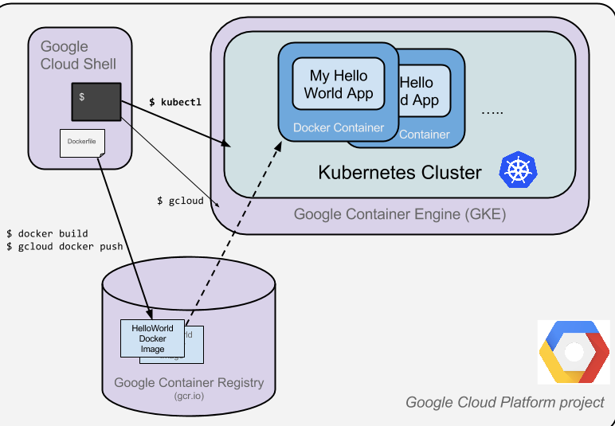
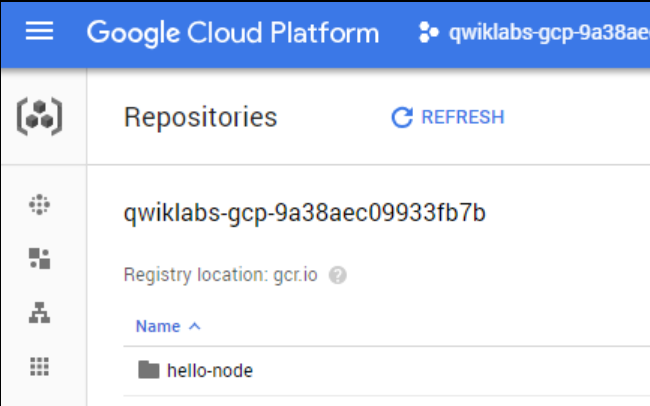
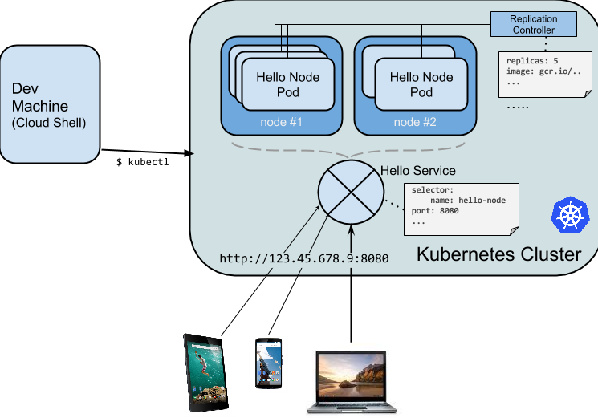

# Overview
The goal of this hands-on lab is for you to turn code that you have developed into a replicated application running on Kubernetes, which is running on Kubernetes Engine. For this lab the code will be a simple Hello World node.js app. Here's a diagram of the various parts in play in this lab. 

Source: [Qwicklab](https://google.qwiklabs.com/focuses/564?parent=catalog)
 


Kubernetes is an open source project (available on kubernetes.io) which can run on many different environments, from laptops to high-availability multi-node clusters; from public clouds to on-premise deployments; from virtual machines to bare metal.

For the purpose of this lab, using a managed environment such as Kubernetes Engine (a Google-hosted version of Kubernetes running on Compute Engine) will allow you to focus more on experiencing Kubernetes rather than setting up the underlying infrastructure.

**What you'll do**
- Create a Node.js server.
- Create a Docker container image.
- Create a container cluster.
- Create a Kubernetes pod.
- Scale up your services.

# Setup
- Activate Google Cloud Shell
- Set PROJECT_ID variable via Google Cloud Shell
```shell
PROJECT_ID=$(gcloud config get-value project)
``` 

# Create your Node.js application
Using Cloud Shell, write a simple Node.js server file named server.js that you'll deploy to Kubernetes Engine.

```javascript
var http = require('http');
var handleRequest = function(request, response) {
  response.writeHead(200);
  response.end("Hello World!");
}
var www = http.createServer(handleRequest);
www.listen(8080);
```

Since Cloud Shell has the node executable installed, run this command to start the node server (the command produces no output):

```shell
node server.js
``` 

Use the built-in Web preview feature of Cloud Shell to open a new browser tab and proxy a request to the instance you just started on port 8080. A new browser tab will open to display your results. Before continuing, return to Cloud Shell and type Ctrl+c to stop the running node server.

Next you will package this application in a Docker container.

# Create a Docker container image
Next, create a Dockerfile file (name Dockerfile) that describes the image you want to build. Docker container images can extend from other existing images, so for this image, we'll extend from an existing Node image.

```shell
FROM node:6.9.2
EXPOSE 8080
COPY server.js .
CMD node server.js
``` 

This "recipe" for the Docker image will: 

- Start from the node image found on the Docker hub.
- Expose port 8080.
- Copy your server.js file to the image.
- Start the node server as we previously did manually.

Build the image with the following:

```shell
docker build -t gcr.io/$PROJECT_ID/hello-node:v1 .
``` 

It'll take some time to download and extract everything, but you can see the progress bars as the image builds. Once complete, test the image locally by running a Docker container as a daemon on port 8080 from your newly-created container image.

```shell
docker run -d -p 8080:8080 gcr.io/$PROJECT_ID/hello-node:v1
``` 

Your output should look something like this:

```shell
325301e6b2bffd1d0049c621866831316d653c0b25a496d04ce0ec6854cb7998
```

To see your results you can use the web preview feature of Cloud Shell or curl from the Cloud Shell prompt: 

```shell
curl http://localhost:8080
```

This is the output you should see:

```shell
Hello World!
```

Next, stop the running container. Find your Docker container ID by running:

```shell
docker ps
```

Your output you should look like this:

```shell
CONTAINER ID        IMAGE                              COMMAND
2c66d0efcbd4        gcr.io/$PROJECT_ID/hello-node:v1    "/bin/sh -c 'node
```

Stop the container by running the following, replacing the [CONTAINER ID] with the value provided from the previous step. The console output should be the container ID. 

```shell
docker stop [CONTAINER ID]
```

Now that the image is working as intended, push it to the Google Container Registry, a private repository for your Docker images, accessible from your Google Cloud projects.

```shell
gcloud auth configure-docker
docker push gcr.io/$PROJECT_ID/hello-node:v1
```

The initial push may take a few minutes to complete. You'll see the progress bars as it builds.

```shell
The push refers to a repository [gcr.io/qwiklabs-gcp-6h281a111f098/hello-node]
ba6ca48af64e: Pushed
381c97ba7dc3: Pushed
604c78617f34: Pushed
fa18e5ffd316: Pushed
0a5e2b2ddeaa: Pushed
53c779688d06: Pushed
60a0858edcd5: Pushed
b6ca02dfe5e6: Pushed
v1: digest: sha256:8a9349a355c8e06a48a1e8906652b9259bba6d594097f115060acca8e3e941a2 size: 2002
```

The container image will be listed in your Console. Select **Navigation menu > Container Registry**. Now you have a project-wide Docker image available which Kubernetes can access and orchestrate.



# Create your cluster

Now you're ready to create your Kubernetes Engine cluster. A cluster consists of a Kubernetes master API server hosted by Google and a set of worker nodes. The worker nodes are Compute Engine virtual machines. Make sure you have set your project using gcloud :

```shell
gcloud config set project $PROJECT_ID
```

Create a cluster with two n1-standard-1 nodes (this will take a few minutes to complete):

```shell
gcloud container clusters create hello-world \
                --num-nodes 2 \
                --machine-type n1-standard-1 \
                --zone us-central1-a
```

Note: You can also create this cluster through the Console by opening the Navigation menu and selecting **Kubernetes Engine > Kubernetes clusters > Create cluster**.

If you select Navigation menu > Kubernetes Engine, you'll see that you now you have a fully-functioning Kubernetes cluster powered by Kubernetes Engine.

It's time to deploy your own containerized application to the Kubernetes cluster! From now on you'll use the kubectl command line (already set up in your Cloud Shell environment).

# Create your pod

A Kubernetes pod is a group of containers tied together for administration and networking purposes. It can contain single or multiple containers. Here you'll use one container built with your Node.js image stored in your private container registry. It will serve content on port 8080. Create a pod with the kubectl run command:

```shell
kubectl run hello-node \
    --image=gcr.io/$PROJECT_ID/hello-node:v1 \
    --port=8080
```

(Output)

```shell
deployment "hello-node" created
```

As you can see, you've created a deployment object. Deployments are the recommended way to create and scale pods. Here, a new deployment manages a single pod replica running the hello-node:v1 image.

To view the deployment, run:

```shell
kubectl get deployments
```

(Output)

```shell
NAME         DESIRED   CURRENT   UP-TO-DATE   AVAILABLE   AGE
hello-node   1         1         1            1           2m
```

To view the pod created by the deployment, run:

```shell
kubectl get pods
```

(Output)

```shell
NAME                         READY     STATUS    RESTARTS   AGE
hello-node-714049816-ztzrb   1/1       Running   0          6m
```

Now is a good time to go through some interesting kubectl commands. None of these will change the state of the cluster:

```shell
kubectl cluster-info
kubectl config view
kubectl get events
kubectl logs <pod-name>
```

You now need to make your pod accessible to the outside world.

# Allow external traffic

By default, the pod is only accessible by its internal IP within the cluster. In order to make the hello-node container accessible from outside the Kubernetes virtual network, you have to expose the pod as a Kubernetes service.

From Cloud Shell you can expose the pod to the public internet with the kubectl expose command combined with the --type="LoadBalancer" flag. This flag is required for the creation of an externally accessible IP:

```shell
kubectl expose deployment hello-node --type="LoadBalancer"
```

(Output)
```
service "hello-node" exposed
```

The flag used in this command specifies that are using the load-balancer provided by the underlying infrastructure (in this case the Compute Engine load balancer). Note that you expose the deployment, and not the pod, directly. This will cause the resulting service to load balance traffic across all pods managed by the deployment (in this case only 1 pod, but you will add more replicas later).

The Kubernetes master creates the load balancer and related Compute Engine forwarding rules, target pools, and firewall rules to make the service fully accessible from outside of Google Cloud Platform.

To find the publicly-accessible IP address of the service, request kubectl to list all the cluster services:

```shell
kubectl get services
```

This is the output you should see:

```shell
NAME         CLUSTER-IP     EXTERNAL-IP      PORT(S)    AGE
hello-node   10.3.250.149   104.154.90.147   8080/TCP   1m
kubernetes   10.3.240.1     <none>           443/TCP    5m
```

There are 2 IP addresses listed for your hello-node service, both serving port 8080. The CLUSTER-IP is the internal IP that is only visible inside your cloud virtual network; the EXTERNAL-IP is the external load-balanced IP. You should now be able to reach the service by pointing your browser to this address: **http://<EXTERNAL_IP>:8080**

At this point you've gained several features from moving to containers and Kubernetes - you do not need to specify on which host to run your workload and you also benefit from service monitoring and restart. Now see what else can be gained from your new Kubernetes infrastructure.

# Scale up your service

One of the powerful features offered by Kubernetes is how easy it is to scale your application. Suppose you suddenly need more capacity. You can tell the replication controller to manage a new number of replicas for your pod:

```shell
kubectl scale deployment hello-node --replicas=4
```

(Output)

```shell
deployment "hello-node" scaled
```

You can request a description of the updated deployment:

```shell
kubectl get deployment
```

(Output)

```shell
NAME         DESIRED   CURRENT   UP-TO-DATE   AVAILABLE   AGE
hello-node   4         4         4            4           16m
```

You can also list the all pods: 

```shell
kubectl get pods
```

(Output)

```shell
NAME                         READY     STATUS    RESTARTS   AGE
hello-node-714049816-g4azy   1/1       Running   0          1m
hello-node-714049816-rk0u6   1/1       Running   0          1m
hello-node-714049816-sh812   1/1       Running   0          1m
hello-node-714049816-ztzrb   1/1       Running   0          16m
```

A declarative approach is being used here. Rather than starting or stopping new instances, you declare how many instances should be running at all times. Kubernetes reconciliation loops makes sure that reality matches what you requested and takes action if needed.

Here's a diagram summarizing the state of your Kubernetes cluster:



# Roll out an upgrade to your service

At some point the application that you've deployed to production will require bug fixes or additional features. Kubernetes helps you deploy a new version to production without impacting your users.

First, modify the application by updating the response message in server.js:

```shell
response.end("Hello Kubernetes World!");
```

Now you can build and publish a new container image to the registry with an incremented tag (v2 in this case) by running the following commands:

```shell
docker build -t gcr.io/$PROJECT_ID/hello-node:v2 .
docker push gcr.io/$PROJECT_ID/hello-node:v2
```

Kubernetes will smoothly update your replication controller to the new version of the application. In order to change the image label for your running container, you will edit the existing hello-node deployment and change the image from gcr.io/PROJECT_ID/hello-node:v1 to gcr.io/PROJECT_ID/hello-node:v2.

To do this, use the kubectl edit command. It opens a text editor displaying the full deployment yaml configuration. It isn't necessary to understand the full yaml config right now, just understand that by updating the spec.template.spec.containers.image field in the config you are telling the deployment to update the pods with the new image.

```shell
kubectl edit deployment hello-node
```

Look for Spec > containers > image and change the version number to v2:
```xml
# Please edit the object below. Lines beginning with a '#' will be ignored,
# and an empty file will abort the edit. If an error occurs while saving this file will be
# reopened with the relevant failures.
#
apiVersion: extensions/v1beta1
kind: Deployment
metadata:
  annotations:
    deployment.kubernetes.io/revision: "1"
  creationTimestamp: 2016-03-24T17:55:28Z
  generation: 3
  labels:
    run: hello-node
  name: hello-node
  namespace: default
  resourceVersion: "151017"
  selfLink: /apis/extensions/v1beta1/namespaces/default/deployments/hello-node
  uid: 981fe302-f1e9-11e5-9a78-42010af00005
spec:
  replicas: 4
  selector:
    matchLabels:
      run: hello-node
  strategy:
    rollingUpdate:
      maxSurge: 1
      maxUnavailable: 1
    type: RollingUpdate
  template:
    metadata:
      creationTimestamp: null
      labels:
        run: hello-node
    spec:
      containers:
      - image: gcr.io/PROJECT_ID/hello-node:v1 ## Update this line ##
        imagePullPolicy: IfNotPresent
        name: hello-node
        ports:
        - containerPort: 8080
          protocol: TCP
        resources: {}
        terminationMessagePath: /dev/termination-log
      dnsPolicy: ClusterFirst
      restartPolicy: Always
      securityContext: {}
      terminationGracePeriodSeconds: 30
```

This is the output you should see:

```shell
deployment "hello-node" edited
```

Run the following to update the deployment with the new image:

```shell
kubectl get deployments
```

New pods will be created with the new image and the old pods will be deleted. This is the output you should see:

```shell
NAME         DESIRED   CURRENT   UP-TO-DATE   AVAILABLE   AGE
hello-node   4         4         4            4           1h
```

While this is happening, the users of your services shouldn't see any interruption. After a little while they'll start accessing the new version of your application. You can find more details on rolling updates in this [documentation](https://kubernetes.io/docs/tutorials/kubernetes-basics/update/update-intro/).